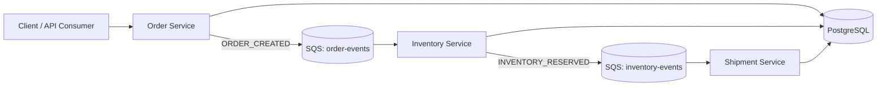
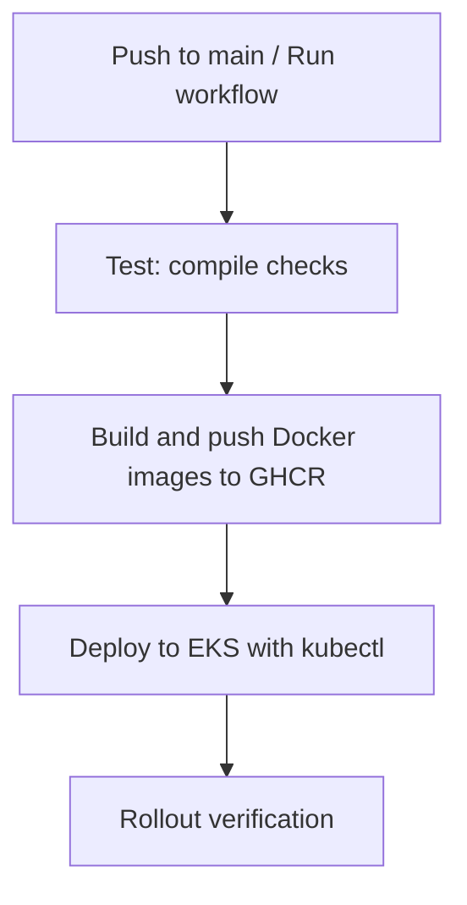
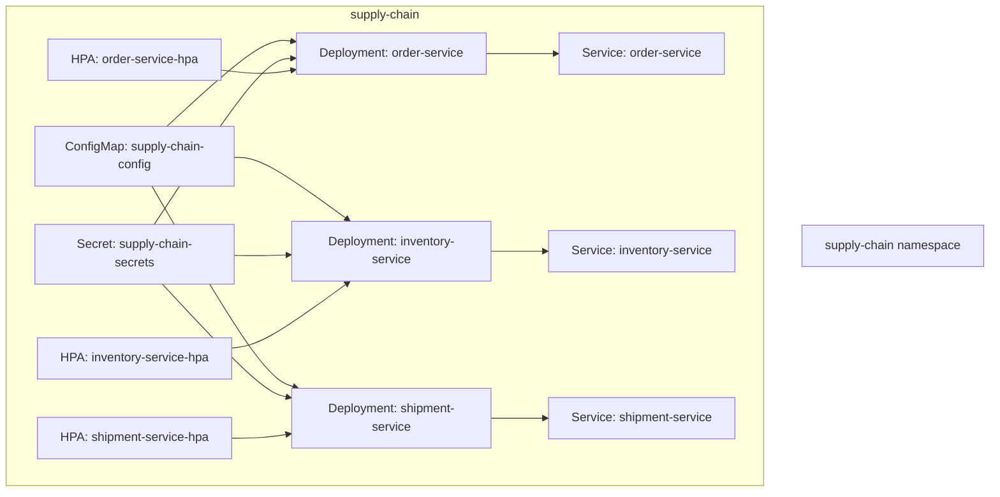
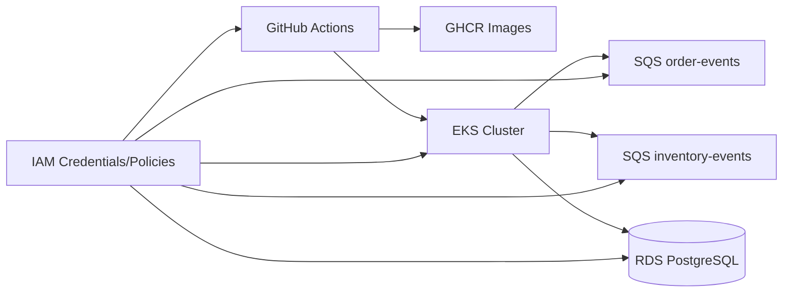

# Master End-to-End Handbook: Supply Chain Microservices Platform

This is the complete practical handbook for this project. It documents what we built, why we built it, exactly how to run and deploy it, what errors we hit, how we fixed them, and how to clean everything up safely.

If you are new to backend, DevOps, AWS, or Kubernetes, this is designed for you.

---

## 1. Introduction and Learning Goals

By the end of this guide, you should be able to:

1. Understand a microservices + event-driven backend architecture.
2. Run all services locally with Docker Compose.
3. Understand and use GitHub Actions CI/CD for build and deploy.
4. Understand core AWS services used in this project.
5. Deploy the platform to EKS and validate rollout.
6. Troubleshoot common real-world deployment failures.
7. Tear down cloud resources to avoid billing.

Project domains:
- Order management
- Inventory management
- Shipment tracking

Architecture style:
- Async Python services (FastAPI + SQLAlchemy Async)
- Event-driven communication with SQS
- Kubernetes deployment (EKS-ready)

---

## 2. System Architecture Overview

### 2.1 High-Level Architecture (Mermaid)



### 2.2 High-Level Architecture (ASCII)

```text
Client
  |
  v
Order Service  ----writes----> PostgreSQL
  |
  | publishes ORDER_CREATED
  v
SQS queue: order-events
  |
  v
Inventory Service ----writes----> PostgreSQL
  |
  | publishes INVENTORY_RESERVED
  v
SQS queue: inventory-events
  |
  v
Shipment Service ----writes----> PostgreSQL
```

### 2.3 Why this architecture?

- Services are decoupled (each domain owns its logic).
- SQS makes asynchronous processing resilient.
- One service can be slow or down without immediate cascading failure.
- Each service can scale independently.
- This pattern is commonly used in production cloud systems.

---

## 3. Service-by-Service Deep Dive

## 3.1 Order Service

Purpose:
- Accept new orders.
- Store order in DB.
- Publish `ORDER_CREATED` event.

Key endpoints:
- `POST /orders`
- `GET /orders/{id}`
- `GET /health`

Flow:
1. Validate request with Pydantic.
2. Create DB row in `orders`.
3. Publish event to SQS `order-events`.
4. Return order response.

## 3.2 Inventory Service

Purpose:
- Manage stock.
- Reserve stock when order is created.
- Publish `INVENTORY_RESERVED`.

Key endpoints:
- `GET /inventory/{product_id}`
- `POST /inventory/update`
- `GET /health`

Concurrency note:
- Uses atomic update condition (`stock >= quantity`) for safe reservation.

## 3.3 Shipment Service

Purpose:
- Create shipment when inventory is reserved.
- Track shipment state.

Key endpoints:
- `GET /shipments/{shipment_id}`
- `GET /shipments/order/{order_id}`
- `POST /shipments/{shipment_id}/status`
- `GET /health`

Idempotency note:
- One shipment per order via unique `order_id` handling.

---

## 4. Local Development and Docker Flow

## 4.1 Why Docker locally?

- Same runtime everywhere (dev and deploy pipelines).
- Easy startup for all dependent services.
- Reduces “works on my machine” issues.

## 4.2 Local startup commands

```bash
cd /Users/admin/chatgpt/supply-chain-system
cp .env.example .env
docker compose up --build -d
```

Check containers:

```bash
docker compose ps
```

Check health APIs:

```bash
curl http://localhost:8001/health
curl http://localhost:8002/health
curl http://localhost:8003/health
```

Expected:

```json
{"status":"ok"}
```

## 4.3 End-to-end local functional flow

Seed inventory first:

```bash
curl -X POST http://localhost:8002/inventory/update \
  -H "Content-Type: application/json" \
  -d '{"product_id":"P-1001","stock":10}'
```

Create order:

```bash
curl -X POST http://localhost:8001/orders \
  -H "Content-Type: application/json" \
  -d '{"product_id":"P-1001","quantity":2,"user_id":"U-42"}'
```

Get shipment by order ID:

```bash
curl http://localhost:8003/shipments/order/<ORDER_ID>
```

Update shipment status:

```bash
curl -X POST http://localhost:8003/shipments/<SHIPMENT_ID>/status \
  -H "Content-Type: application/json" \
  -d '{"status":"IN_TRANSIT"}'
```

---

## 5. Git, GitHub, and GitHub Actions CI/CD

## 5.1 GitHub actions role in this project

Pipeline file:
- `.github/workflows/ci-cd.yml`

Pipeline stages:
1. `test` job
2. `build-and-push` job
3. `deploy` job

## 5.2 CI/CD pipeline (Mermaid)



## 5.3 CI/CD pipeline (ASCII)

```text
Git push/main
   |
   v
[TEST JOB]
python compile checks
   |
   v
[BUILD JOB]
build Docker images -> push GHCR
   |
   v
[DEPLOY JOB]
configure aws creds + kubeconfig
apply manifests
rollout status checks
```

## 5.4 Why each stage exists

- Test: fail fast on broken code before image build.
- Build/push: generate immutable deployable artifacts.
- Deploy: update live Kubernetes resources.
- Rollout verify: ensure services are actually healthy, not just applied.

## 5.5 Required repository secrets

- `KUBE_CONFIG_DATA`
- `ORDER_SERVICE_DB_URL`
- `INVENTORY_SERVICE_DB_URL`
- `SHIPMENT_SERVICE_DB_URL`
- `AWS_ACCESS_KEY_ID`
- `AWS_SECRET_ACCESS_KEY`

Generate `KUBE_CONFIG_DATA`:

```bash
./scripts/print_kube_config_secret.sh
```

---

## 6. AWS Services Used: Purpose + How We Used Them

## 6.1 IAM

Purpose:
- Controls what user/service is allowed to do.

Used for:
- CLI access via access key + secret key.
- Permissions for EKS, EC2, CloudFormation, RDS, SQS operations.

## 6.2 SQS

Purpose:
- Managed queue for asynchronous event transfer.

Used queues:
- `order-events`
- `inventory-events`

Commands:

```bash
aws sqs create-queue --queue-name order-events
aws sqs create-queue --queue-name inventory-events
aws sqs list-queues
```

## 6.3 RDS (PostgreSQL)

Purpose:
- Managed relational database service.

Used for:
- Persistent storage for all three microservices.

DB URL format:

```text
postgresql+asyncpg://postgres:<PASSWORD>@<RDS_ENDPOINT>:5432/<DB_NAME>
```

## 6.4 EKS

Purpose:
- Managed Kubernetes control plane.

Used for:
- Running all services as deployments.
- Handling replica management and health probes.

Cluster creation command:

```bash
eksctl create cluster \
  --name supply-chain-cluster \
  --region ap-south-1 \
  --nodegroup-name supply-chain-ng \
  --node-type t3.medium \
  --nodes 2 \
  --nodes-min 2 \
  --nodes-max 3 \
  --managed
```

## 6.5 CloudWatch (Concept in this project)

Purpose:
- Centralized logs and metrics in AWS.

In this project state:
- Services are structured for cloud logging readiness.
- Full CloudWatch agent/log shipping was not fully wired in manifests yet.

## 6.6 Secrets Manager (Concept in this project)

Purpose:
- Secure secret storage and rotation.

In this project state:
- We used GitHub secrets + Kubernetes secret for deployment.
- Secret Manager integration is planned future-hardening path.

---

## 7. Kubernetes Manifests and Deployment Model

Manifest location:
- `infra/kubernetes/`

Resources used:
- Namespace
- ConfigMap
- Secret template
- Deployments (order, inventory, shipment)
- Services (ClusterIP)
- HPAs
- Kustomization

## 7.1 Kubernetes runtime topology (Mermaid)



## 7.2 Kubernetes runtime topology (ASCII)

```text
Namespace: supply-chain
  |- ConfigMap (queue URLs, region, env)
  |- Secret (db urls, aws creds)
  |- Deployment order-service (2 replicas) -> Service order-service
  |- Deployment inventory-service (2 replicas) -> Service inventory-service
  |- Deployment shipment-service (2 replicas) -> Service shipment-service
  |- HPA per service
```

Why ConfigMap + Secret split:
- ConfigMap for non-sensitive configuration.
- Secret for sensitive credentials.

---

## 8. End-to-End Production Deployment Walkthrough

## 8.1 Prerequisites

1. AWS account and IAM user with required permissions.
2. Installed tools:

```bash
aws --version
kubectl version --client
eksctl version
```

3. AWS CLI configured:

```bash
aws configure
aws sts get-caller-identity
```

## 8.2 Create SQS and capture URLs

```bash
aws sqs create-queue --queue-name order-events
aws sqs create-queue --queue-name inventory-events
aws sqs list-queues
```

## 8.3 Configure `infra/kubernetes/base/configmap.yaml`

Set:
- `ORDER_SQS_QUEUE_URL`
- `INVENTORY_SQS_QUEUE_URL`
- `INVENTORY_EVENT_QUEUE_URL`
- `SHIPMENT_SQS_QUEUE_URL`
- `AWS_ENDPOINT_URL: ""`

## 8.4 Create RDS correctly for EKS

Critical rule:
- RDS must be reachable from EKS network.

Recommended path:
- Create RDS in same VPC as EKS cluster.
- Add SG inbound rule for port `5432` from EKS node SG.

## 8.5 Create EKS and configure kubeconfig

```bash
eksctl create cluster \
  --name supply-chain-cluster \
  --region ap-south-1 \
  --nodegroup-name supply-chain-ng \
  --node-type t3.medium \
  --nodes 2 \
  --nodes-min 2 \
  --nodes-max 3 \
  --managed
```

```bash
aws eks update-kubeconfig --name supply-chain-cluster --region ap-south-1
kubectl get nodes
```

## 8.6 Add GitHub secrets

Set repository secrets:
- DB URLs (3)
- AWS keys (2)
- `KUBE_CONFIG_DATA` (1)

Generate kube config secret:

```bash
./scripts/print_kube_config_secret.sh
```

## 8.7 Trigger workflow

GitHub UI:
- Actions -> Supply Chain CI/CD -> Run workflow -> main.

## 8.8 Verify rollout

```bash
kubectl -n supply-chain get pods
kubectl -n supply-chain rollout status deployment/order-service
kubectl -n supply-chain rollout status deployment/inventory-service
kubectl -n supply-chain rollout status deployment/shipment-service
```

Success criteria:
- All pods `1/1 Running`
- All deployment rollouts successful.

---

## 9. Post-Deploy Functional Testing in EKS

Port-forward in separate terminals:

```bash
kubectl -n supply-chain port-forward svc/order-service 8001:80
kubectl -n supply-chain port-forward svc/inventory-service 8002:80
kubectl -n supply-chain port-forward svc/shipment-service 8003:80
```

Then execute functional flow:

```bash
curl http://localhost:8001/health
curl http://localhost:8002/health
curl http://localhost:8003/health
```

```bash
curl -X POST http://localhost:8002/inventory/update \
  -H "Content-Type: application/json" \
  -d '{"product_id":"P-1001","stock":10}'
```

```bash
curl -X POST http://localhost:8001/orders \
  -H "Content-Type: application/json" \
  -d '{"product_id":"P-1001","quantity":2,"user_id":"U-42"}'
```

```bash
curl http://localhost:8003/shipments/order/<ORDER_ID>
```

```bash
curl -X POST http://localhost:8003/shipments/<SHIPMENT_ID>/status \
  -H "Content-Type: application/json" \
  -d '{"status":"IN_TRANSIT"}'
```

---

## 10. Real Incident Log (What Broke and How We Fixed It)

This section captures real failures encountered during deployment.

| Incident | Symptom | Root Cause | Fix Applied | Verification |
|---|---|---|---|---|
| Workflow expression error | Workflow invalid: unrecognized `secrets` in job-level `if` | GitHub expression context restriction in that placement | Moved secret checks into deploy step logic | Workflow YAML validated and ran |
| Missing AWS creds in deploy | `NoCredentials` in deploy job | Runner had no AWS auth before kubectl/EKS access | Added `aws-actions/configure-aws-credentials` step | Deploy progressed past auth |
| Image not found | `ImagePullBackOff` with SHA tag not found | Deploy used full SHA tag not pushed by build | Added explicit full `sha-${{ github.sha }}` tag in image metadata | New pods pulled images successfully |
| Port env conflict | Validation error for `ORDER_SERVICE_PORT` like `tcp://...` | K8s service links auto-injected env var names colliding with app settings | Added `enableServiceLinks: false` in deployments | That specific validation error disappeared |
| DB connection timeout | Pods crash at startup with asyncpg timeout | RDS network path not reachable from EKS (VPC mismatch / SG path) | Updated DB networking approach and SG rules; used EKS-reachable DB endpoint | Rollout eventually successful |

### Key lesson
Most production deployment failures are infrastructure wiring issues (auth, image tags, networking), not business logic bugs.

---

## 11. Validation Checklist (Stage-by-Stage)

## 11.1 Local validation

- [ ] `docker compose ps` shows services up
- [ ] `/health` returns success for all services
- [ ] End-to-end API flow works locally

## 11.2 CI/CD validation

- [ ] `test` job green
- [ ] `build-and-push` green
- [ ] `deploy` green
- [ ] No skipped critical steps unexpectedly

## 11.3 EKS validation

- [ ] Nodes ready: `kubectl get nodes`
- [ ] Pods running: `kubectl -n supply-chain get pods`
- [ ] Rollouts successful for all deployments
- [ ] Functional order->inventory->shipment flow works via port-forward

## 11.4 Troubleshooting quick commands

```bash
kubectl -n supply-chain get pods -o wide
kubectl -n supply-chain get deploy,rs
kubectl -n supply-chain describe pod <pod-name>
kubectl -n supply-chain logs <pod-name>
kubectl -n supply-chain logs <pod-name> --previous
kubectl -n supply-chain get events --sort-by=.lastTimestamp | tail -n 50
```

---

## 12. Cost Management and Teardown Runbook

This section is critical. EKS + EC2 + NAT + RDS can generate charges quickly.

## 12.1 What may incur charges in this setup

- EKS control plane
- EC2 worker nodes
- NAT Gateway
- RDS instances
- Data transfer and storage

## 12.2 Full teardown commands

Delete EKS cluster (removes nodegroups and most related infra):

```bash
eksctl delete cluster --name supply-chain-cluster --region ap-south-1
```

Delete RDS instances:

```bash
aws rds delete-db-instance --db-instance-identifier supply-chain-db --skip-final-snapshot --region ap-south-1
aws rds delete-db-instance --db-instance-identifier supply-chain-db-eks --skip-final-snapshot --region ap-south-1
```

Delete SQS queues:

```bash
aws sqs delete-queue --queue-url https://sqs.ap-south-1.amazonaws.com/<ACCOUNT_ID>/order-events
aws sqs delete-queue --queue-url https://sqs.ap-south-1.amazonaws.com/<ACCOUNT_ID>/inventory-events
```

Verify cleanup:

```bash
aws eks list-clusters --region ap-south-1
aws rds describe-db-instances --region ap-south-1
aws sqs list-queues --region ap-south-1
```

## 12.3 Local disk cleanup

```bash
docker compose down --remove-orphans
docker system prune -af --volumes
```

---

## 13. AWS Networking and Dependency Diagram

### 13.1 Mermaid



### 13.2 ASCII

```text
GitHub Actions
   | builds/pushes
   v
GHCR images
   |
   | deployed by kubectl to
   v
EKS cluster (pods)
   |--> SQS order-events
   |--> SQS inventory-events
   \--> RDS PostgreSQL

IAM policies/keys authorize all above operations.
```

---

## 14. Appendix A: Complete Command Reference

## 14.1 Local

```bash
cp .env.example .env
docker compose up --build -d
docker compose ps
docker compose logs -f
```

## 14.2 AWS CLI baseline

```bash
aws configure
aws sts get-caller-identity
```

## 14.3 SQS

```bash
aws sqs create-queue --queue-name order-events
aws sqs create-queue --queue-name inventory-events
aws sqs list-queues
```

## 14.4 EKS and kubectl

```bash
eksctl create cluster \
  --name supply-chain-cluster \
  --region ap-south-1 \
  --nodegroup-name supply-chain-ng \
  --node-type t3.medium \
  --nodes 2 \
  --nodes-min 2 \
  --nodes-max 3 \
  --managed

aws eks update-kubeconfig --name supply-chain-cluster --region ap-south-1
kubectl get nodes
kubectl -n supply-chain get pods
```

## 14.5 Deploy diagnostics

```bash
kubectl -n supply-chain get deploy,rs,pods -o wide
kubectl -n supply-chain rollout status deployment/order-service
kubectl -n supply-chain rollout status deployment/inventory-service
kubectl -n supply-chain rollout status deployment/shipment-service
```

---

## 15. Appendix B: Glossary

- **Microservice**: Small independent service for a domain.
- **Event-driven**: Services communicate by publishing/consuming events.
- **SQS**: Queue service used for asynchronous message passing.
- **EKS**: Managed Kubernetes on AWS.
- **RDS**: Managed relational database service.
- **HPA**: Kubernetes Horizontal Pod Autoscaler.
- **Rollout**: Deployment update process in Kubernetes.
- **ImagePullBackOff**: Kubernetes cannot pull container image.
- **CrashLoopBackOff**: Container keeps starting and crashing.

---

## 16. Suggested Next Improvements (Production Hardening)

1. Replace startup `create_all` with Alembic migrations.
2. Add external secrets integration (AWS Secrets Manager + External Secrets Operator).
3. Add OpenTelemetry tracing and CloudWatch log forwarding.
4. Add dead-letter queues (DLQ) for SQS consumers.
5. Add integration tests running in CI.
6. Move to least-privilege IAM policies.

---

This handbook is the long-form canonical learning + operations reference for this project.
